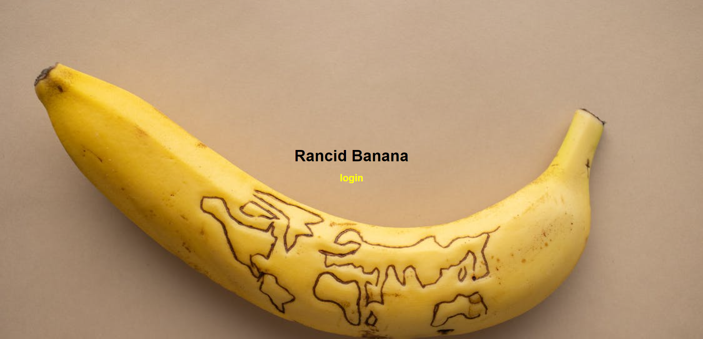
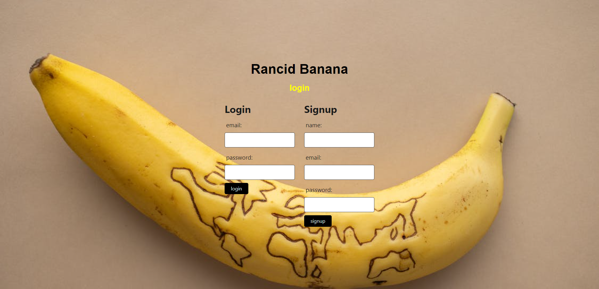
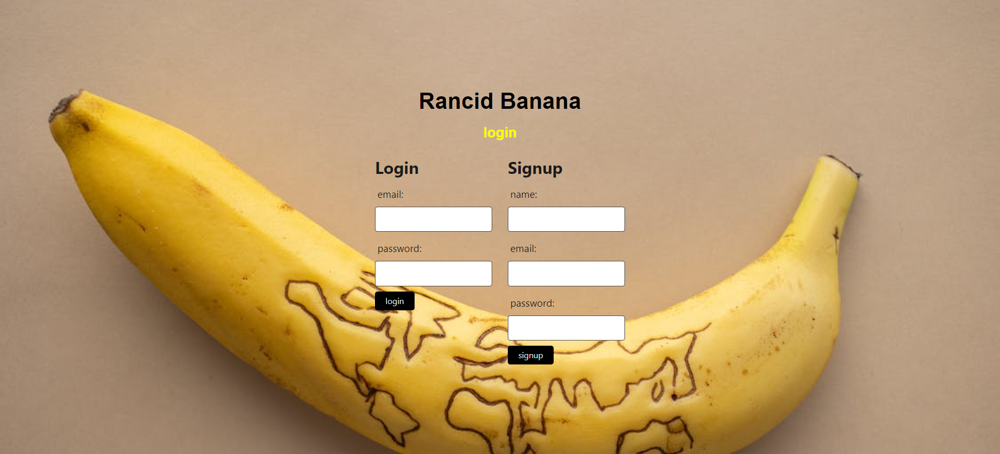

# Project 2: Rancid Banana

## User Story
As a User I want to create an application that connects me to fellow movie buffs so that we may share our ideas and save movie recommendations. 

## Decription
This application gives users the ability to: create their own profiles where they can view information about all their favorite movies by searching them up and pulling in their IMDB. You can also add movies to a wish list, and then write - and save - reviews about the movies you saw.

## Technologies Used
* Handlebars.js (template engine)
* Express
* Node
* movier npm
* JavaScript
* Sequelize
* HTML
* CSS

## Usage
* You may access the application by either clicking on the Heroku link, or running it in your server. 

## Screenshot
Homepage:

Login/Sign up page:

Review page:

## Links
GitHub repo: https://github.com/Ale-Miret/Project-2.git

Deployed link: 

## Colaborators
* Jason Faust
* Alejandra Miret

